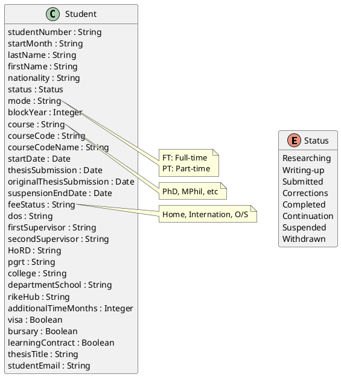

```plantuml
@startuml

skinparam classAttributeIconSize 0
hide empty methods

enum Status {
    Researching
    Writing-up
    Submitted
    Corrections
    Completed
    Continuation
    Suspended
    Withdrawn
}

class Student {
    studentNumber : String 
    startMonth : String
    lastName : String
    firstName : String
    nationality : String
    status : Status
    mode : String
    blockYear : Integer
    course : String
    courseCode : String
    courseCodeName : String
    startDate : Date
    thesisSubmission : Date
    originalThesisSubmission : Date
    suspensionEndDate : Date
    feeStatus : String
    dos : String
    firstSupervisor : String
    secondSupervisor : String
    HoRD : String
    pgrt : String
    college : String
    departmentSchool : String
    rikeHub : String
    additionalTimeMonths : Integer
    visa : Boolean
    bursary : Boolean
    learningContract : Boolean
    thesisTitle : String
    studentEmail : String
}

note right of Student::mode
FT: Full-time
PT: Part-time
end note

note right of Student::course
PhD, MPhil, etc
end note

note right of Student::feeStatus
Home, Internation, O/S
end note

@enduml
```