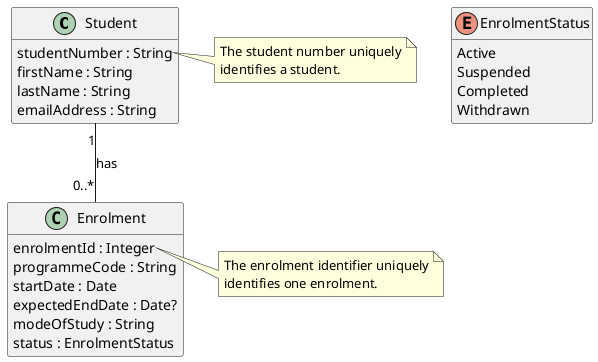

```plantuml
@startuml Week5 Initial Domain Model: Student and Enrolment

skinparam classAttributeIconSize 0
hide empty methods

class Student {
    studentNumber : String
    firstName : String
    lastName : String
    emailAddress : String
}

class Enrolment {
    enrolmentId : Integer
    programmeCode : String
    startDate : Date
    expectedEndDate : Date?
    modeOfStudy : String
    status : EnrolmentStatus
}

enum EnrolmentStatus {
    Active
    Suspended
    Completed
    Withdrawn
}

note right of Student::studentNumber
The student number uniquely
identifies a student.
end note

note right of Enrolment::enrolmentId
The enrolment identifier uniquely
identifies one enrolment.
end note

Student "1" -- "0..*" Enrolment : has

@enduml
```