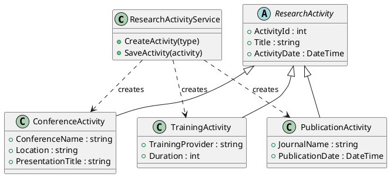
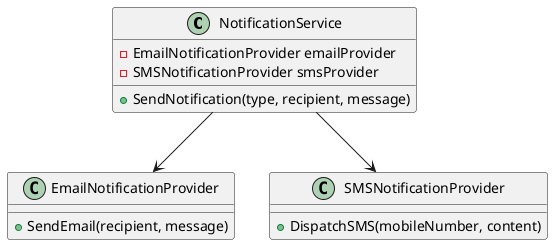
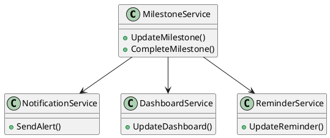

```plantuml
@startuml

class ResearchActivityService {
    +CreateActivity(type)
    +SaveActivity(activity)
}

abstract class ResearchActivity {
    +ActivityId : int
    +Title : string
    +ActivityDate : DateTime
}

class ConferenceActivity {
    +ConferenceName : string
    +Location : string
    +PresentationTitle : string
}

class PublicationActivity {
    +JournalName : string
    +PublicationDate : DateTime
}

class TrainingActivity {
    +TrainingProvider : string
    +Duration : int
}

ResearchActivity <|-- ConferenceActivity
ResearchActivity <|-- PublicationActivity
ResearchActivity <|-- TrainingActivity

ResearchActivityService ..> ConferenceActivity : creates
ResearchActivityService ..> PublicationActivity : creates
ResearchActivityService ..> TrainingActivity : creates

@enduml
```

   

```plantuml
@startuml

    class NotificationService {
        -EmailNotificationProvider emailProvider
        -SMSNotificationProvider smsProvider
        +SendNotification(type, recipient, message)
    }

    class EmailNotificationProvider {
        +SendEmail(recipient, message)
    }

    class SMSNotificationProvider {
        +DispatchSMS(mobileNumber, content)
    }

    NotificationService --> EmailNotificationProvider
    NotificationService --> SMSNotificationProvider

@enduml
```

```plantuml
@startuml
top to bottom direction

class MilestoneService {
    +UpdateMilestone()
    +CompleteMilestone()
}

class NotificationService {
    +SendAlert()
}

class DashboardService {
    +UpdateDashboard()
}

class ReminderService {
    +UpdateReminder()
}

MilestoneService --> NotificationService
MilestoneService --> DashboardService
MilestoneService --> ReminderService

```

